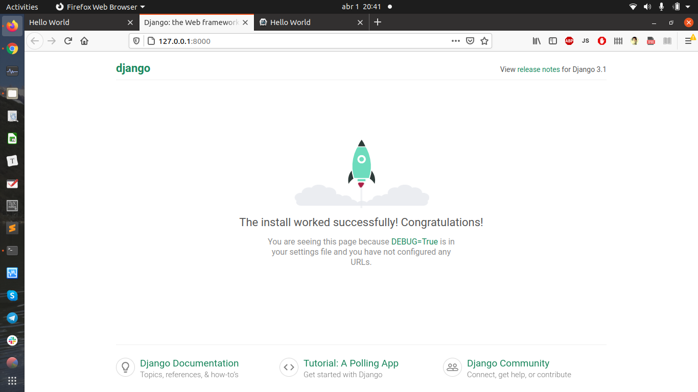

# myDjango
This is my repo for studying the Django framework. My goal is to build a web application using the MVC pattern and Python programming.

```bash
cd Django
cd mysite
python3 manage.py runserver
#This will run a webserver on 127.0.0.1:8000
```



```bash
mysite/
├── db.sqlite3
├── manage.py
└── mysite
    ├── __init__.py
    ├── __init__.pyc
    ├── __pycache__
    │   ├── __init__.cpython-38.pyc
    │   ├── settings.cpython-38.pyc
    │   ├── urls.cpython-38.pyc
    │   └── wsgi.cpython-38.pyc
    ├── settings.py
    ├── settings.pyc
    ├── urls.py
    ├── urls.pyc
    ├── wsgi.py
    └── wsgi.pyc

```


